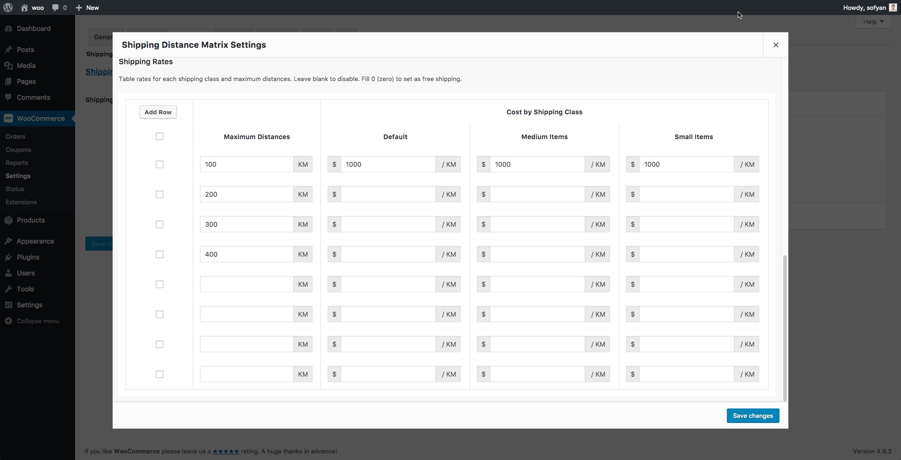

<!-- DO NOT EDIT THIS FILE; it is auto-generated from readme.txt -->
# WooCommerce Shipping Distance Matrix

WooCommerce shipping rates calculator based on products shipping class and route distances that calculated using Google Maps Distance Matrix API.

**Contributors:** [sofyansitorus](https://profiles.wordpress.org/sofyansitorus) 
**Tags:** [woocommerce shipping](https://wordpress.org/plugins/tags/woocommerce shipping), [local shipping](https://wordpress.org/plugins/tags/local shipping), [private shipping](https://wordpress.org/plugins/tags/private shipping) 
**Requires at least:** 4.8 
**Tested up to:** 4.9.4 
**Stable tag:** trunk (master) 
**License:** [GPL-2.0+](http://www.gnu.org/licenses/gpl-2.0.txt) 
**Requires PHP:** 5.6 

## Description ##

WooCommerce shipping rates calculator based on products shipping class and route distances that calculated using Google Maps Distance Matrix API.

This plugin perfect for online store that use local shipping or private shipping such as selling flower, food & beverage but not limited to.

This plugin require Google Maps Distance Matrix API Services enabled in your Google Console. [Click here](https://developers.google.com/maps/documentation/distance-matrix/get-api-key) to get API Key and to enable the services.
### Features ###
* Set shipping cost with flat rate or based on per km/mi schema.
* Set shipping cost by product shipping class.
* Set unlimited distances ranges.
* Set shipping origin location coordinates using Maps Picker.
* Set distances unit: Mile, Kilometre.
* Set travel mode: Driving, Walking, Bicycling.
* Set route restrictions: Avoid Tolls, Avoid Highways, Avoid Ferries, Avoid Indoor.
* Set cost calculation type per order or per item.
* Set visibility distance info to customer.
* Set fallback request if there is no results for API request using full address.

## Installation ##

### Minimum Requirements ###
* WordPress 4.8 or later
* WooCommerce 3.0 or later

### AUTOMATIC INSTALLATION ###
Automatic installation is the easiest option as WordPress handles the file transfers itself and you don’t even need to leave your web browser. To do an automatic install of WooCommerce Shipping Distance Matrix, log in to your WordPress admin panel, navigate to the Plugins menu and click Add New.

In the search field type “WooCommerce Shipping Distance Matrix” and click Search Plugins. You can install it by simply clicking Install Now. After clicking that link you will be asked if you’re sure you want to install the plugin. Click yes and WordPress will automatically complete the installation. After installation has finished, click the ‘activate plugin’ link.

### MANUAL INSTALLATION ###
1. Download the plugin zip file to your computer
1. Go to the WordPress admin panel menu Plugins > Add New
1. Choose upload
1. Upload the plugin zip file, the plugin will now be installed
1. After installation has finished, click the ‘activate plugin’ link

## Frequently Asked Questions ##

### How to set the plugin settings? ###
You can setup the plugin setting from the Shipping Zones settings. Please check the following video tutorial how to setup the WooCommerce Shipping Zones:

[Video](https://www.youtube.com/watch?v=eThWmrnBP38) by [InMotion Hosting](https://www.inmotionhosting.com)

### Where can I get support? ###
You can either support ticket at plugin support forum :

* [Plugin Support Forum](https://wordpress.org/support/plugin/wcsdm)

### Where can I report bugs? ###
You can report bugs at the plugin GitHub repository:

* [Plugin Support Forum](https://wordpress.org/support/plugin/wcsdm)
* [Plugin GitHub Repository](https://github.com/sofyansitorus/WooCommerce-Shipping-Distance-Matrix)

### Can I contribute to develop this plugin? ###
I always welcome and encourage contributions to this plugin. Please visit the plugin GitHub repository:

* [Plugin GitHub Repository](https://github.com/sofyansitorus/WooCommerce-Shipping-Distance-Matrix)

## Screenshots ##

### Settings panel top area

### Settings panel bottom area

## Changelog ##

### 1.3.4 ###
* Improvements - Add new option: Enable Fallback Request.

### 1.3.3 ###
* Fix - Change route restriction to single select.
* Improvements - Added fallback to input store location manually on google map error.

### 1.3.2 ###
* Fix - Fix issue with localization decimal delimeter.
* Improvements - Added language parameter for Maps API request.

### 1.3.1 ###
* Fix - Fix API request URL.
* Improvements - Switched from WP Cache Object to Transient.

### 1.3.0 ###
* Improvements - Add Google Maps Picker.

### 1.2.9 ###
* Fix - Fix issue when comma as decimal separator.

### 1.2.8 ###
* Improvements - More info in debugging mode.
* Fix - Table rates input fields styling.

### 1.2.7 ###
* Fix - Remove Maps Place Picker.

### 1.2.6 ###
* Fix - Maps picker.

### 1.2.5 ###
* Improvements - Add option to charge shipping per distance unit.

### 1.2.4 ###
* Improvements - Add "Map Location Picker" for store location setting.
* Improvements - Setting panel UI/UX improved more user friendly.

### 1.2.3 ###
* Improvements - Add new filter hooks: woocommerce_wcsdm_shipping_destination_info.
* Improvements - Add new filter hooks: woocommerce_wcsdm_shipping_origin_info.
* Improvement - Tweak settings panel UI and default value.
* Improvement - Add validation for settings field: gmaps_api_key, origin_lat, origin_lng, table_rates.

### 1.2.2 ###
* Fix - woocommerce_shipping_wcsdm_is_available filter.

### 1.2.1 ###
* Improvement - Add filter to enable city field in shipping calculator form.
* Fix - Filter destination address, address_2, city, postcode fields for shipping calculator request.
* Fix - Change wrong API request param from mode to avoid.

### 1.2.0 ###
* Feature - Set visibility distance info to customer.

### 1.1.1 ###
* Improvement - Enable WP Object Cache for API HTTP request to improve the speed and reduce request count to API server.
* Fix - Remove unused js code.

### 1.1.0 ###
* Feature - Set cost calculation type per order or per item.
* Localization - Update POT file.

### 1.0.0 ###
* Feature - Set shipping cost by product shipping class.
* Feature - Set unlimited distances ranges.
* Feature - Set origin info by coordinates.
* Feature - Set distances unit: Mile, Kilometre.
* Feature - Set travel mode: Driving, Walking, Bicycling.
* Feature - Set route restrictions: Avoid Tolls, Avoid Highways, Avoid Ferries, Avoid Indoor.

## Upgrade Notice ##

### 1.3.4 ###
This version include fixes and improvements. Upgrade immediately.

